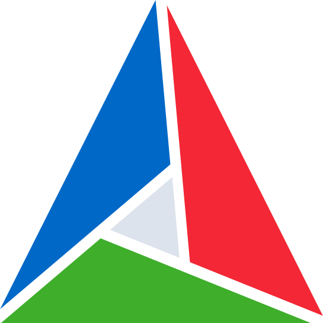
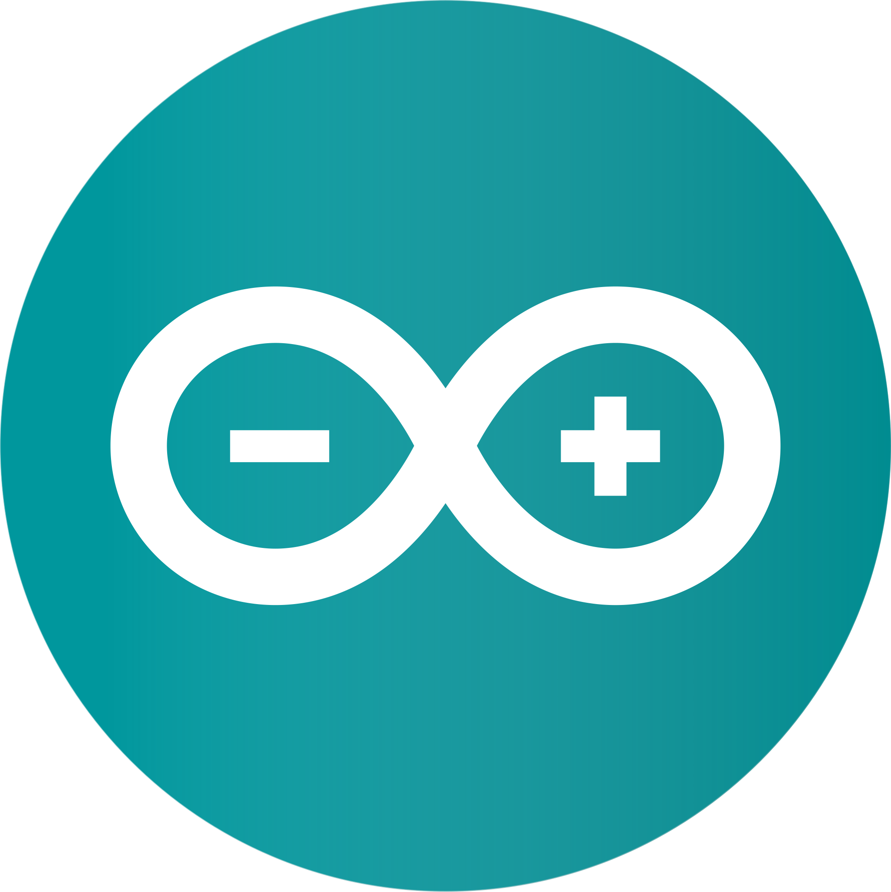

<h1 align="center">Hello stranger!</h1>
<h3 align="center">Someone who codes C++, Lua, Python, (Node)JS, and a bit of (System)Verilog. Interested in machine learning, cyber security, information theory, reverse engineering, computer science, and physics.</h3>

  

  &nbsp;
  

<h3 align="center">Socials</h3>

  
  
  

  

<h3 align="center">Current tech stack</h3>

  
  
  
  
  
  
  

<h3 align="center">Prior tech stack</h3>

  
  

